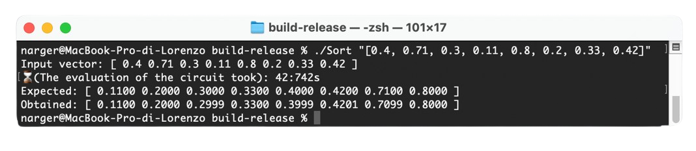

<center> 
  <h1 align="center">Practical Sorting of Encrypted Numbers in Approximate Homomorphic Encryption</h1>
 
  <p align="center">
    <a href="https://orcid.org/0000-0001-5093-7932"><strong>Lorenzo Rovida</strong></a>
    ·
    <a href="https://orcid.org/0000-0002-8105-4371"><strong>Alberto Leporati</strong></a>
  </p>
  <span line-height:10>
  <p align="center" line-height:20><sup>University of Milan-Bicocca, <br>
    Department of Informatics, Systems, and Communication, <br>
  $\texttt{\{lorenzo.rovida, alberto.leporati\}@unimib.it}$
  </sup></p></span>
</center>
</br>
<p align="center"></p>
<!--  -->

---


This repository contains the source code for the work-in-progress paper *Practical Sorting of Encrypted Numbers in Approximate Homomorphic Encryption*. With this code it is possibly to sort a vector of encrypted values in "reasonable" time (e.g., few minutes for more than one thousand elements).

The idea is to use a [Sorting Network](https://en.wikipedia.org/wiki/Sorting_network), which is an *oblivious* algorithm whose behavior does not depend on the input. The network is implemented using the [OpenFHE](https://eprint.iacr.org/2022/915) implementation of the [RNS-CKKS scheme](https://eprint.iacr.org/2020/1118)


## Requirements
It is pretty straightforward to use this source code, first of all **be sure** that all requirements are satisfied.

- cmake
- OpenFHE (tested on [v1.1.4](https://github.com/openfheorg/openfhe-development/releases/tag/v1.1.4))

## How to use it

First of all clone the repository:

```
git clone https://github.com/narger-ef/Practical-Sorting-of-Encrypted-Numbers
```

Then, make a `build` folder and build the project with `cmake`
```
mkdir build
cmake -B "build" -S Sort
```
Before launching the program, go to the just created folder:

```
cd build
```

Now it is possible to launch the program! Notice that, before doing that, at least one argument is required:

### Required arguments:
One of the following two arguments is required in order to correctly give the input to the circuit.

- To use as input a vector of values from 0 to `N` randomly shuffled, use `--random N` where `N` is a power of two. For example:
```
./Sort --random 8
```

- To use as input a file, use `--file FILENAME` where `FILENAME` is the selected file. Notice that the file must contain a power-of-two number of values. For example:
```
./Sort --file "../inputs/four_values.txt"
```

- Alternatively, you can provide a vector directly by enclosing it in square brackets, for example: `"[0.5, 0.12, 0.71, 0.42]"`. Notice that, also in this case, the length of the vector $|v|$ must be a power of two. 
```
./Sort "[0.5, 0.12, 0.71, 0.42]"
```

Be sure that, the input vector given when using `--file`, or the input vector provided as a string, must be composed of values in $[0, 1]$. Nevertheless, the program can work on a larger interval $[0, r]$, check the scaling factor optional argument.

### Optional arguments:

> [!IMPORTANT]
> Be sure to check the paper in order to fully understand the impact of each argument.

It is also possible to change the behavior of the program by using some optional argument:

- `--toy_parameters`: with this argument the cryptosystem will not have the minimum requirement of $\lambda = 128$ security bits against classical computers. Suggested in case you want to play around with the algorithm. For example:
```
./Sort --random 8 --toy_parameters
```

- `--verbose N`: define the quantity of information. `N = -1` does not print anything, `N = 0` prints only the result, `N = 1` gives basic information and `N = 2` gives all the details. Default is 0. For example:
```
./Sort --random 8 --toy_parameters --verbose 1
```

- `--poly_degree`: the degree of the Chebyshev polynomial approximating the ReLU function. Suggested values, from [here](https://github.com/openfheorg/openfhe-development/blob/main/src/pke/examples/FUNCTION_EVALUATION.md): 119, 247, 495
```
./Sort --random 8 --poly_degree 247
```

- `--scaling_factor`: the input values will be scaled (divided) by this value. Useful if the input values are not in $[0, 1]$, but in $[0, r]$, where $r$ is the scaling factor (default is `scaling_factor = 1`)
```
./Sort "[4, 14, 10, 7, 8, 14, 20, 2]" --scaling_factor 20
```

- `--error_correction` performs an error correction after Chebyshev evaluations. This ensures that the values are always in $[0, 1]$ after each *min* call, but the precision is reduced. Check Section 2.2 for more details. For example:
```
./Sort "[1, 0, 0, 0, 0, 0, 0, 0]" --poly_degree 119 --error_correction
```
The above code will not work without the `error_correction` flag.


## How it works

The circuit implements the Bitonic Sort algorithm, which creates a sorting network that sorts $2^n$ values.
<p></p>

WIP

## Citing

WIP


## Authors

- Lorenzo Rovida (`lorenzo.rovida@unimib.it`)
- Alberto Leporati (`alberto.leporati@unimib.it`)

Made with <3  at [Bicocca Security Lab](https://www.bislab.unimib.it), at University of Milan-Bicocca.


### Declaration

This is a proof of concept and, even though parameters are created with $\lambda \geq 128$ security bits (according to [Homomorphic Encryption Standards](https://homomorphicencryption.org/standard)), this circuit is intended for educational purposes only.
